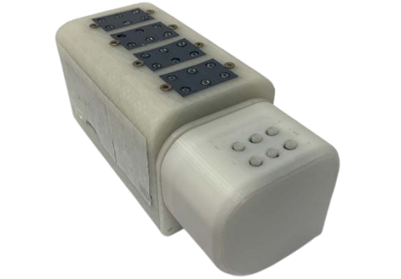

# 점자교육기기
**Project Date :** September 2021

본 프로젝트는 서울과학기술대학교 적정기술 사회봉사 프로그램 **슈퍼로컬 프로젝트**의 지원을 받아 진행되었습니다.   🎥 [유투브](https://www.youtube.com/watch?v=PNk0jNRVqwc)

### 적정기술
적정기술은 지역의 환경, 사회적 조건, 사용자의 상황에 맞춰 실제 도움이 되는 기술을 의미한다. 비용은 저렴하고 사용법은 간단하여, 필요한 사람이 직접 활용할 수 있도록 만드는 것이 핵심이다.

### 높은 점자 문맹률
국내 시각장애인 약 25만 명 중 60%가 점자를 읽고 쓰지 못한다. 
또한 대부분이 **중도 시각장애인**으로, 갑작스러운 시력 상실로 점자 교육이 더욱 필요하다. 조사에 따르면 중도 시각장애인 1000명 중 89%가 점자 교육이 필요하다고 느끼지만, 47%는 교육을 원해도 받지 못하고 있다. 이유는 다음과 같다:
- 점자가 **학습 난이도가 높음**  
- 점자 교재가 **제한적임**  
- 보호자가 점자를 몰라 **가정에서 학습 지원이 어려움**  

### 프로젝트 개요
이러한 문제를 해결하기 위해 **언제 어디서나 가족과 함께 점자를 학습할 수 있는 점자 교육 보조기술**을 개발한다.

- 점자 읽기·쓰기 연습을 지원하는 기기  
- 가정에서 사용할수 있게 어플과 연동
- 음성 안내와 간단한 입력 방식으로 접근성 향상

이를 통해 점자 교육의 접근성을 높이고, 점자 문맹률을 줄이는 것을 목표로 한다.

